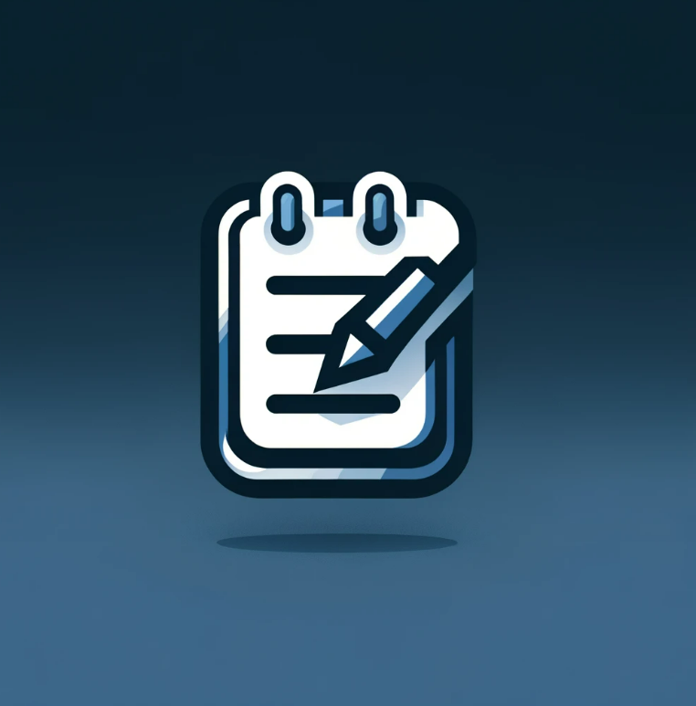

# notes-app
Notebook app performing CRUD operations using Django web framework

## NoteItDown - A Personal Note-Taking Application
### 🚀 Overview
NoteItDown is a sleek, user-friendly note-taking application designed to help users organize their thoughts, ideas, and
tasks efficiently. Built with a focus on simplicity and functionality, NoteItDown allows users to create, save, and 
manage their notes seamlessly. Whether you're jotting down a quick reminder or compiling detailed notes, NoteItDown
offers a clutter-free environment to capture your thoughts.

### ✨ Features
User Registration and Authentication: Secure sign-up and login process, ensuring that your notes are private and protected.
Create and Manage Notes: Effortlessly add new notes with titles and descriptions. Edit or delete existing ones as per your needs.
Persistent Storage: All notes are securely stored in the database, tied to individual user accounts, ensuring that your data is available whenever you return.
Responsive Design: A clean and responsive interface that adapts to different screen sizes, providing a consistent experience across devices.

### 🚀 Technology Stack
- python 3.9
- django 4.0
- django rest framework
- simple-jwt
- psql
- javascript/jquery
- html/css
- docker/docker-compose
- pre-commit
- gunicorn
- nginx

### 📚 Description
1. **Backend**: Developed in Python 3.9, leveraging the powerful Django framework for the core application logic. 
The RESTful API endpoints are meticulously crafted using Django's REST framework, facilitating smooth communication
between the frontend and backend. 
2. **Frontend**: A combination of pure HTML, CSS, and JavaScript, enhanced with Bootstrap for a modern and responsive design. 
This stack was chosen for its simplicity and effectiveness in creating dynamic user interfaces.
3. **Authentication**: Utilizes JWT (JSON Web Tokens) for secure user authentication, ensuring that each user's session is
safely managed.
4. **Deployment**: The application is containerized using Docker, making deployment seamless and scalable.
Gunicorn serves as the WSGI HTTP server, interfacing with Django, while NGINX is used as a reverse proxy, handling client requests efficiently.
5. **Database**: Notes and user data are stored in a robust database, ensuring data persistence and security.

